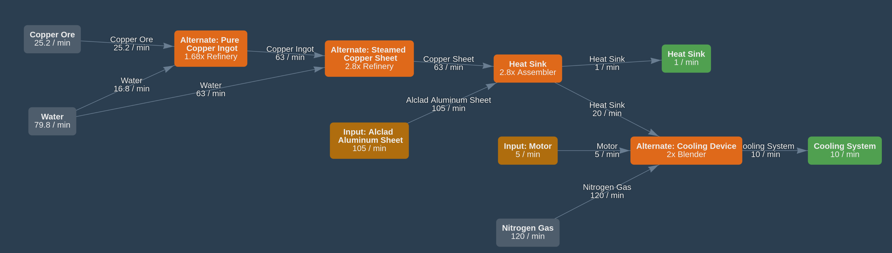

# Satis Master Plan  {ignore=true .title}

Updated on:
```python {cmd=true,output="html",hide}
from datetime import datetime
print("{:%d/%b/%y %H:%M}".format(datetime.now()))
```

Edit this page: https://github.com/totobest/satis-master-plan

----


<!-- @import "[TOC]" {cmd="toc" depthFrom=1 depthTo=6 orderedList=true} -->

<!-- code_chunk_output -->

1. [Objectives](#objectives)
2. [Principles](#principles)
3. [Overview](#overview)
4. [Train network](#train-network)
    1. [Connections between sub factories](#connections-between-sub-factories)
5. [Sub factories Schemas](#sub-factories-schemas)
    1. [Motors](#motors)
    2. [Computing](#computing)
    3. [Cooling](#cooling)
        1. [With Copper Sheet](#with-copper-sheet)
        2. [Alternative with Rubber (not recommended)](#alternative-with-rubber-not-recommended)
    4. [Electronics](#electronics)
    5. [Frames](#frames)
    6. [Project Assembly Parts #8](#project-assembly-parts-8)
    7. [Oscillators](#oscillators)
    8. [Oil Based Products](#oil-based-products)
    9. [Nitric Acid](#nitric-acid)
    10. [Nitrogen](#nitrogen)
    11. [Aluminum Products](#aluminum-products)

<!-- /code_chunk_output -->


# Objectives

- Produce and bring Phase #8 Project Assembly parts to the Space Elevator    
    - 5/min Magnetic Field Generator    
    - 5/min Assembly Director System
    - 3/min Thermal Propulsion Rocket
    - 1/min Nuclear Pasta
    At these rates, parts will be produced in 100 minutes in theory.
- Prepare infrastructure for next phase

# Principles

1) Train network as factory bus
1) Group dependents items together (ie: Computer --> Radio Control Unit --> Super Computer) in a sub factory
1) Sub factories should be autonomous as much as possible, meaning does not depend of other sub factories
1) Build sub factories near needed raw resources.
1) Prefer to transport complex products instead of raw products
    - Especially when transformed products are fewer than required products;
    Example: it would be more efficient to transport Iron Plates instead of Iron Ingots because 3 Iron Ingots are transformed into 2 Iron Plates using regular recipe so it takes less place in a train's wagon.


---

# Overview


@import "statuses.csv"


---
# Train network

Train network = factory bus
**Owner:** paquerette

## Connections between sub factories


@import "train_connections.mermaid"


!!! note
    - Number between edges means X/min
    - It seems there is a cyclic dependency between Computing, Motors and Cooling. Meaning Computing needs Cooling which needs Motors which needs Computing.
    It is in fact not really cyclic in details: Motors needs Radios from Computing to build Turbo Motors only and Computing needs Cooling to build Super Computers only.
    


---

# Sub factories Schemas

## Motors

https://www.satisfactorytools.com/1.0/production?share=zyVe2isuAbdWtIlAnNMT


!!! done
    - Blueprints are ready


!!! todo    
    - Place buildings

## Computing
https://www.satisfactorytools.com/1.0/production?share=QDJzQNfvTaLDBrhAb2bA


!!! todo
    - Export Computers
    - Produce and export Radio Control Units
    - Produce and export Super Computers

## Cooling


### With Copper Sheet

https://www.satisfactorytools.com/1.0/production?share=maXEBA2GVfhUi7Qg8lsC


### Alternative with Rubber (not recommended)

!!! warning
    This alternative does not follow #5 principle.
    It should not import Rubber as Copper Sheet can be easily produced.


https://www.satisfactorytools.com/1.0/production?share=TfUouPOiGpesiNo1p744


## Electronics
https://www.satisfactorytools.com/1.0/production?share=YCeqoQJ3bbJD52mptq0p


## Frames
https://www.satisfactorytools.com/1.0/production?share=hkATsgLm04axIrTAkyyC


## Project Assembly Parts #8
https://www.satisfactorytools.com/1.0/production?share=tC29QeafYMDLbDfDHtgN


!!! todo
    - Build train stations (done for Frames)
    - Produce or import Reinforced Plates
    - Produce or import Steam Beams
    - Produce more cable?

## Oscillators

TODO


## Oil Based Products

https://www.satisfactorytools.com/1.0/production?share=7sP8RrBNWKGdEzP1m0eN


## Nitric Acid

https://www.satisfactorytools.com/1.0/production?share=UL923Lh89gJFaIhCMdTz


## Nitrogen

## Aluminum Products