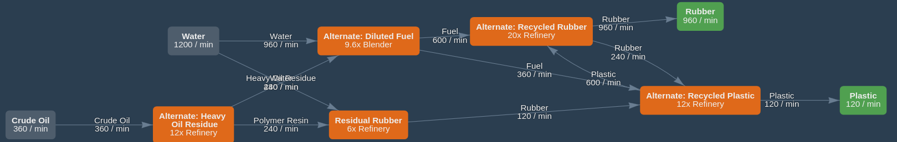
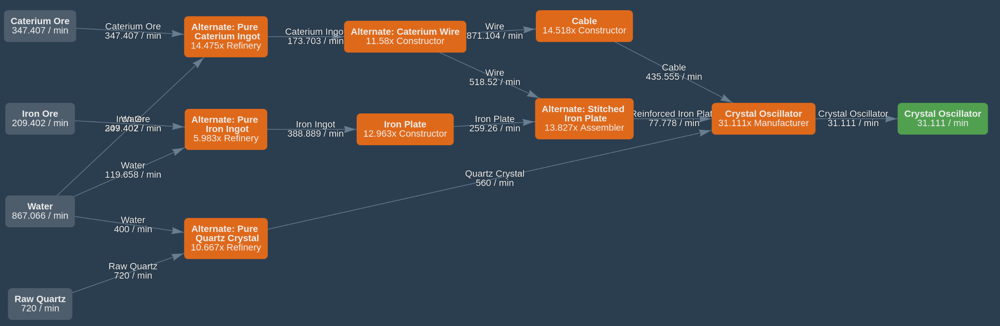
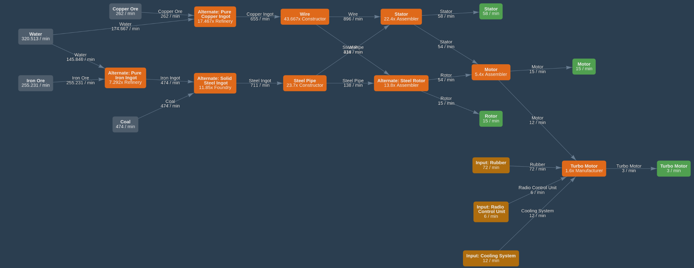
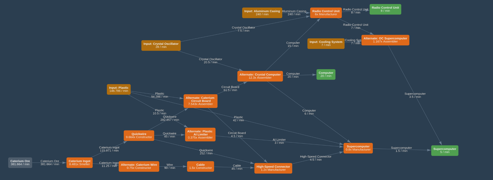
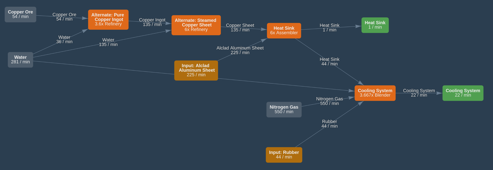
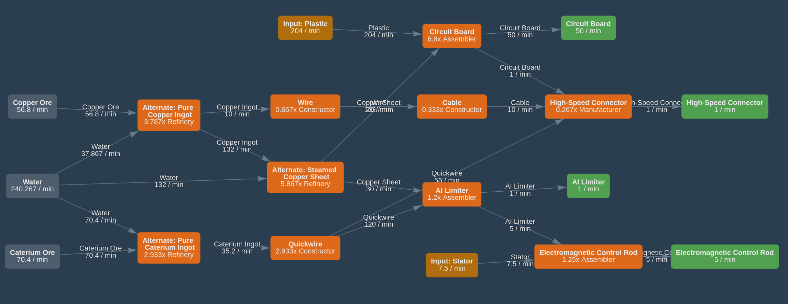

@import "assets/style.css"

# Satis Master Plan  {ignore=true .title}


Updated on:
```python {cmd=true,output="html",hide}
from datetime import datetime
print("{:%d/%b/%y %H:%M}".format(datetime.now()))
```

Edit this page: https://github.com/totobest/satis-master-plan

----


<!-- @import "[TOC]" {cmd="toc" depthFrom=1 depthTo=6 orderedList=true} -->

<!-- code_chunk_output -->

1. [Objectives](#objectives)
2. [Principles](#principles)
3. [Overview](#overview)
4. [Train network](#train-network)
5. [Sub factories Schemas](#sub-factories-schemas)
    1. [Oil Based Products](#oil-based-products)
    2. [Oscillators](#oscillators)
    3. [Motors](#motors)
    4. [Computing](#computing)
    5. [Cooling](#cooling)
        1. [With Copper Sheet](#with-copper-sheet)
        2. [Alternative with Rubber (not recommended)](#alternative-with-rubber-not-recommended)
    6. [Electronics](#electronics)
    7. [Frames](#frames)
    8. [Project Assembly Parts #8](#project-assembly-parts-8)
    9. [Nitric Acid](#nitric-acid)
    10. [Nitrogen](#nitrogen)
    11. [Aluminum Products](#aluminum-products)

<!-- /code_chunk_output -->


# Objectives

- Produce and transport the following Project Assembly parts to the Space Elevator:
    - **Magnetic Field Generator**: 5 units per minute
    - **Assembly Director System**: 5 units per minute
    - **Thermal Propulsion Rocket**: 3 units per minute
    - **Nuclear Pasta**: 1 unit per minute
    With these production rates, the required parts should be ready in approximately 100 minutes.
- Additionally, prepare the necessary infrastructure to support the upcoming phase.

# Principles

1. Use the train network as a "factory bus" to efficiently transport items between sub-factories.
1. Group dependent items together in sub-factories. For example, produce items like Computers, Radio Control Units, and Super Computers within the same sub-factory.
1. Design sub-factories to be as autonomous as possible, minimizing dependencies on other sub-factories.
1. To improve transportation efficiency, prioritize transporting processed products over raw materials.
    - This is especially beneficial when the transformed products take up less space than the raw materials required to create them.
    - For example, transporting Iron Plates instead of Iron Ingots is more efficient because, using the standard recipe, 3 Iron Ingots are converted into 2 Iron Plates, which occupy less space in a train wagon.
1. Position sub-factories close to the required raw resources for easier transportation using belts.
1. Allow the option to duplicate entire sub-factories to easily scale up production as needed.


---

# Overview


@import "statuses.csv"


---
# Train network

Train network = factory bus
**Owner:** paquerette

**Connections between sub factories:**


@import "train_connections.mermaid"


!!! note
    Numbers between edges indicate the production rate in units per minute (X/min).

    ~~Initially, there appeared to be a cyclic dependency between **Computing**, **Motors**, and **Cooling**:
        - **Computing** required **Cooling** for Super Computers.
        - **Cooling** required **Motors**.
        - **Motors** required **Radios** from **Computing** for Turbo Motors.  
    However, these dependencies are not fully cyclic when examined in detail:
        - **Motors** rely on **Computing** only for Radios needed to build Turbo Motors.
        - **Computing** relies on **Cooling** solely to produce Super Computers.~~
    The cyclic dependencies between sub-factories have now been removed, simplifying the production flow.
    


---

# Sub factories Schemas

## Oil Based Products

https://www.satisfactorytools.com/1.0/production?share=7sP8RrBNWKGdEzP1m0eN




## Oscillators

https://www.satisfactorytools.com/1.0/production?share=ypeO0xj28PxZJARBnVtK


!!! info
    - Updated for more throughput
        - It needs more Raw Quartz!
            - Is it possible?


## Motors

https://www.satisfactorytools.com/1.0/production?share=oHaKKa7DpHmRSa3AxJlN


!!! done
    - Blueprints are ready


!!! todo    
    - Place buildings

## Computing

https://www.satisfactorytools.com/1.0/production?share=857oi1w6o4dITqI64nUW


!!! todo
    - Export Computers
    - Produce and export Radio Control Units
    - Produce and export Super Computers

## Cooling


### With Copper Sheet

https://www.satisfactorytools.com/1.0/production?share=g2GsJulQzprj8BrlGzZT


### Alternative with Rubber (not recommended)

!!! warning
    This alternative does not follow the #3 principle.
    It imports Rubber although the regular recipe needs Copper Sheet which can be easily produced.


https://www.satisfactorytools.com/1.0/production?share=TfUouPOiGpesiNo1p744


## Electronics
https://www.satisfactorytools.com/1.0/production?share=pmOLmGKJ0tvJ51dw0N3Z


## Frames
https://www.satisfactorytools.com/1.0/production?share=hkATsgLm04axIrTAkyyC


## Project Assembly Parts #8
https://www.satisfactorytools.com/1.0/production?share=tC29QeafYMDLbDfDHtgN


!!! todo
    - Build train stations (done for Frames)
    - Produce or import Reinforced Plates
    - Produce or import Steam Beams
    - Produce more cable?


## Nitric Acid

https://www.satisfactorytools.com/1.0/production?share=UL923Lh89gJFaIhCMdTz


## Nitrogen

## Aluminum Products