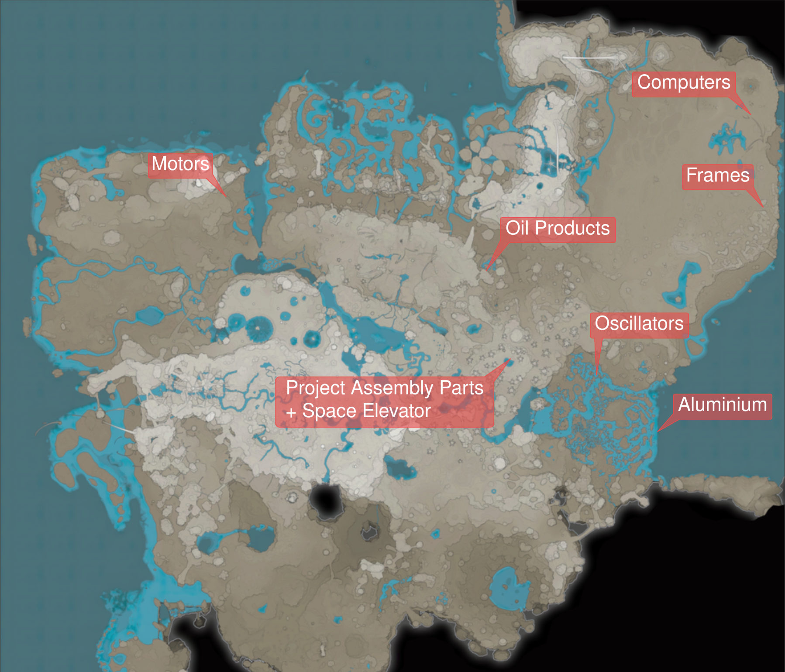
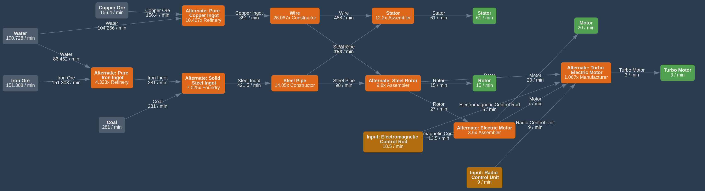
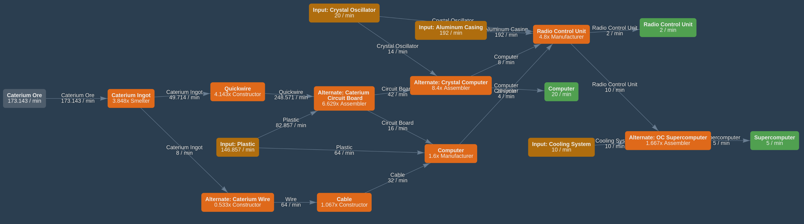
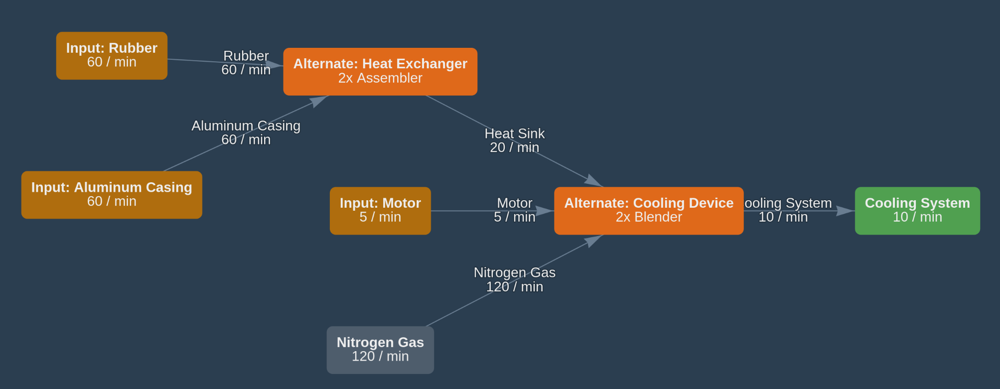
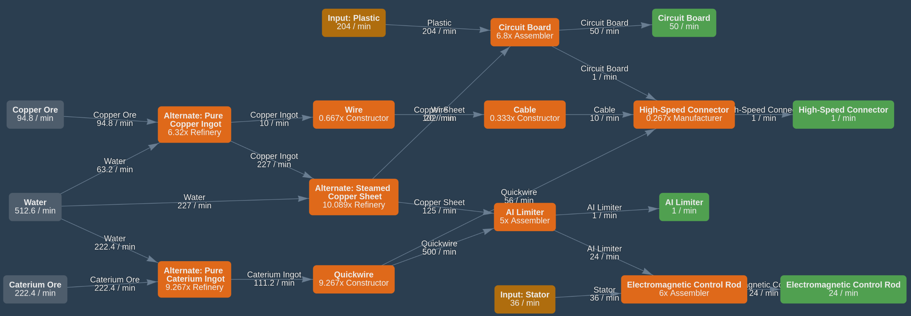
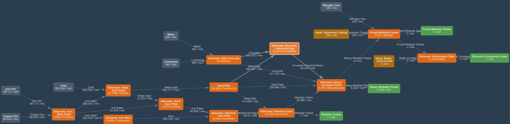
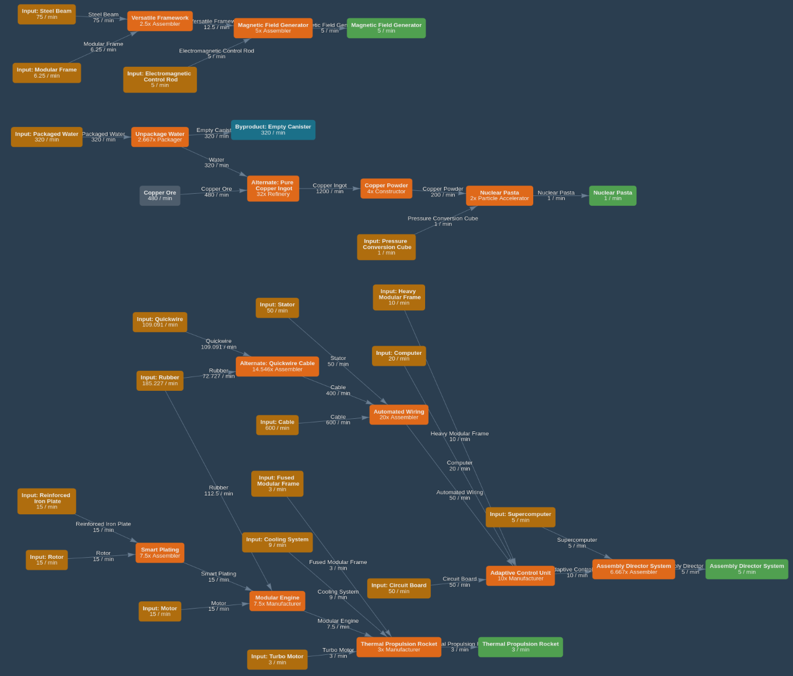

# Satis Master Plan  {ignore=true}

Updated on:
```python {cmd=true,output="html",hide}
from datetime import datetime
print("{:%d/%b/%y %H:%M}".format(datetime.now()))
```

Edit this page: https://github.com/totobest/satis-master-plan

----


<!-- @import "[TOC]" {cmd="toc" depthFrom=1 depthTo=6 orderedList=true} -->

<!-- code_chunk_output -->

1. [Objectives](#objectives)
2. [Principles](#principles)
3. [Overview](#overview)
4. [Train network](#train-network)
    1. [Connections between sub factories](#connections-between-sub-factories)
5. [Sub factories Schemas](#sub-factories-schemas)
    1. [Motors](#motors)
    2. [Computing](#computing)
    3. [Cooling](#cooling)
    4. [Electronics](#electronics)
    5. [Frames](#frames)
    6. [Project Assembly Parts #8](#project-assembly-parts-8)
    7. [Oscillators](#oscillators)
    8. [Aluminium Products](#aluminium-products)
    9. [Oil Based Products](#oil-based-products)

<!-- /code_chunk_output -->


# Objectives

- Produce and bring Phase #8 Project Assembly parts to the Space Elevator    
    - 5/min Magnetic Field Genetator    
    - 5/min Assembly Director System
    - 3/min Thermal Propulsion Rocket
    - 1/min Nuclear Pasta
    At these rates, parts will be produced in 100 minutes in theory.
- Prepare infrastructure for next phase

# Principles

- Train network as factory bus
- Group produced dependents items (ie: Circuit Board --> Computer --> Super Computer) together in a sub factory
- Build sub factories near needed raw ressources if possible

---

# Overview




@import "statuses.csv"


---
# Train network

Train network = factory bus
**Owner:** paquerette

## Connections between sub factories


@import "train_connections.mermaid"


!!! note
    - Some sub factories have inter-dependencies
      - example: Motors needs Rod from Electronics and Electronics needs Stator from Motors
    - Number = X/min


---

# Sub factories Schemas

## Motors

https://www.satisfactorytools.com/1.0/production?share=zyVe2isuAbdWtIlAnNMT


!!! todo
    - Motors
      - Place buildings

## Computing
https://www.satisfactorytools.com/1.0/production?share=QDJzQNfvTaLDBrhAb2bA


!!! todo
    - Computing
      - Export Computers
      - Produce and export Radio Control Units
      - Produce and export Super Computers

## Cooling
https://www.satisfactorytools.com/1.0/production?share=TfUouPOiGpesiNo1p744



## Electronics
https://www.satisfactorytools.com/1.0/production?share=YCeqoQJ3bbJD52mptq0p


## Frames
https://www.satisfactorytools.com/1.0/production?share=hkATsgLm04axIrTAkyyC



## Project Assembly Parts #8
https://www.satisfactorytools.com/1.0/production?share=tC29QeafYMDLbDfDHtgN


!!! todo
    - Project Assemby Parts
      - Build train stations (done for Frames)
      - Produce or import Reinforced Plates
      - Produce or import Steam Beams
      - Produce more cable?

## Oscillators

## Aluminium Products

## Oil Based Products

