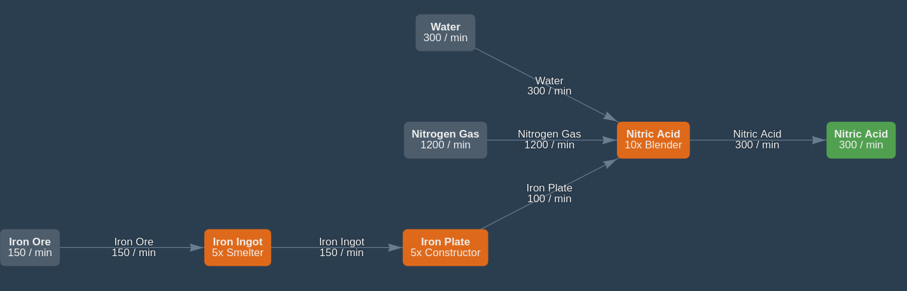

@import "assets/style.css"

# Satis Master Plan  {ignore=true .title}

Edit this page: https://github.com/totobest/satis-master-plan

Updated on:
```python {cmd=true,output="html",hide}
from datetime import datetime
print("{:%d/%b/%y %H:%M}".format(datetime.now()))
```

----
Changelog:

```bash {cmd=true,hide}
git log -10 --pretty=format:"%h - %an, %aI : %s" --date=format:"%Y-%b-%d %H:%M:%S"
```


---


<!-- @import "[TOC]" {cmd="toc" depthFrom=1 depthTo=6 orderedList=true} -->

<!-- code_chunk_output -->

1. [Objectives](#objectives)
2. [Principles](#principles)
3. [Overview](#overview)
4. [Totals imports/exports](#totals-importsexports)
5. [Train network](#train-network)
6. [Sub factories Diagrams](#sub-factories-diagrams)
    1. [Oil Based Products](#oil-based-products)
    2. [Oscillators](#oscillators)
    3. [*tors](#tors)
    4. [Computing](#computing)
    5. [Cooling](#cooling)
    6. [Electronics](#electronics)
    7. [Frames](#frames)
    8. [Aluminum Products](#aluminum-products)
    9. [Project Assembly Parts #4](#project-assembly-parts-4)
    10. [Nuclear Pasta x4](#nuclear-pasta-x4)
    11. [Time Crystal](#time-crystal)
    12. [Ficsite Trigon](#ficsite-trigon)
    13. [Project Assembly Parts #5](#project-assembly-parts-5)
7. [Power](#power)
8. [Annexes](#annexes)
    1. [Nitric Acid](#nitric-acid)

<!-- /code_chunk_output -->


# Objectives

- Produce and transport the following Project Assembly parts #5 to the Space Elevator:
    - **Nuclear Pasta**: 4 unit per minute
    - **Biochemical Sculptor**: 4 units per minute
    - **AI Expansion Server**: 1 unit per minute
    - **Ballistic Warp Drive**: 1 unit per minute
    
    With these production rates, the required parts should be ready in approximately 4 hours.
- Additionally, prepare the necessary infrastructure to support the upcoming phase.

# Principles

1. Use the train network as a "factory bus" to efficiently transport items between sub-factories.
1. Group dependent items together in sub-factories. For example, produce items like Computers, Radio Control Units, and Super Computers within the same sub-factory.
1. Design sub-factories to be as autonomous as possible, minimizing dependencies on other sub-factories.
1. To improve transportation efficiency, prioritize transporting processed products over raw materials.
    - This is especially beneficial when the transformed products take up less space than the raw materials required to create them.
    - For example, transporting Iron Plates instead of Iron Ingots is more efficient because, using the standard recipe, 3 Iron Ingots are converted into 2 Iron Plates, which occupy less space in a train wagon.
1. Position sub-factories close to the required raw resources for easier transportation using belts.
1. Allow the option to duplicate entire sub-factories to easily scale up production as needed.


---

# Overview


@import "statuses.csv"


---
# Totals imports/exports


@import "totals.csv"

# Train network

Train network = factory bus
**Owner:** paquerette

**Connections between sub factories:**


@import "train_connections.mermaid"


!!! note
    Numbers between edges indicate the production rate in units per minute (X/min).    


---

# Sub factories Diagrams

## Oil Based Products

https://www.satisfactorytools.com/1.0/production?share=2nOD5zH4jJhEn4Qtv4Yn


!!! todo
    Upgrade factory to alt recipes (recycled plastic/rubber) for more throughput


## Oscillators

https://www.satisfactorytools.com/1.0/production?share=hBKqAloHlJYo0wOxNMHL


!!! info
    - Updated for more throughput
        - It needs more Raw Quartz!


## *tors

https://www.satisfactorytools.com/1.0/production?share=oHaKKa7DpHmRSa3AxJlN


## Computing

https://www.satisfactorytools.com/1.0/production?share=5PWIxtVClciB1axEh1lz


## Cooling

https://www.satisfactorytools.com/1.0/production?share=kBKGy6Hod3RiHngNF6Qu


!!!warning
    Nitrogen is imported


## Electronics
https://www.satisfactorytools.com/1.0/production?share=jPkLFL2EquEO0Dv2Ok00


## Frames

https://www.satisfactorytools.com/1.0/production?share=wtzrvIfY1p0fyQHAbVTv


!!!warning
    Nitrogen is imported


## Aluminum Products
!!! todo


## Project Assembly Parts #4
https://www.satisfactorytools.com/1.0/production?share=e7GlNJll7kKWx93MNoKA


## Nuclear Pasta x4

!!!note
    Nuclear Pasta is part of PAP #4.
    It needs to be upgraded to increase production rate 4 times.
https://www.satisfactorytools.com/1.0/production?share=EsS8ooGOFMhnvUlP0Oub


## Time Crystal

!!!note
    Can be built next to PAP5

https://www.satisfactorytools.com/1.0/production?share=ADq1XcWyj50kS5nTqABd


## Ficsite Trigon

!!!note
    Can be built next to PAP5

https://www.satisfactorytools.com/1.0/production?share=gKVqLTFCYFUQoVYcF069


## Project Assembly Parts #5
https://www.satisfactorytools.com/1.0/production?share=HgAha7WFnga02GGFP2pj


!!!note
    Located next to PAP4


# Power

!!! todo
    Should we go nuclear?


# Annexes

## Nitric Acid

https://www.satisfactorytools.com/1.0/production?share=UL923Lh89gJFaIhCMdTz

